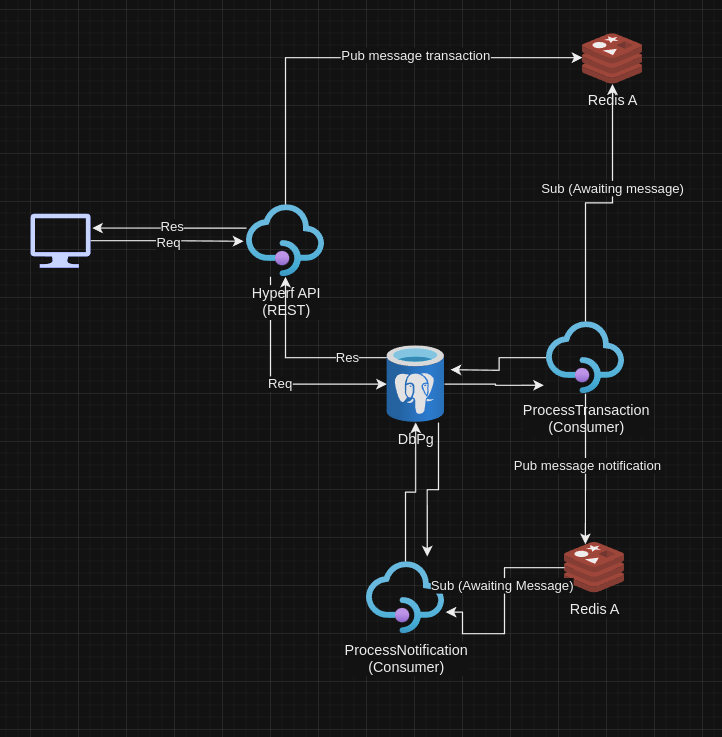

[](https://php.net)
[](https://hyperf.com)

# Hyperf Skeleton
Application developed with php and hyperf.

If you have doubts about the structure, at the end we have the diagram.

- [Requirements](#requirements)
- [Running](#running)

## Requirements

| Tool                                               | Versão |
|----------------------------------------------------|--------|
| [docker](https://www.docker.com/)                  | latest |
| [docker-compose](https://docs.docker.com/compose/) | latest |


## Pre run
To start all services

```shell
cp .env.example .env
```

## Running

To start all services

```shell
docker-compose up -d --build
```

####  Note: It will be necessary to run the sql from the base located in `migrations/main.sql`

## Documentation
To see all routes, navigate to:
```
collections/postman.json
```

## Architecture


###

## License
The Hyperf framework is open-source software licensed under the MIT license.